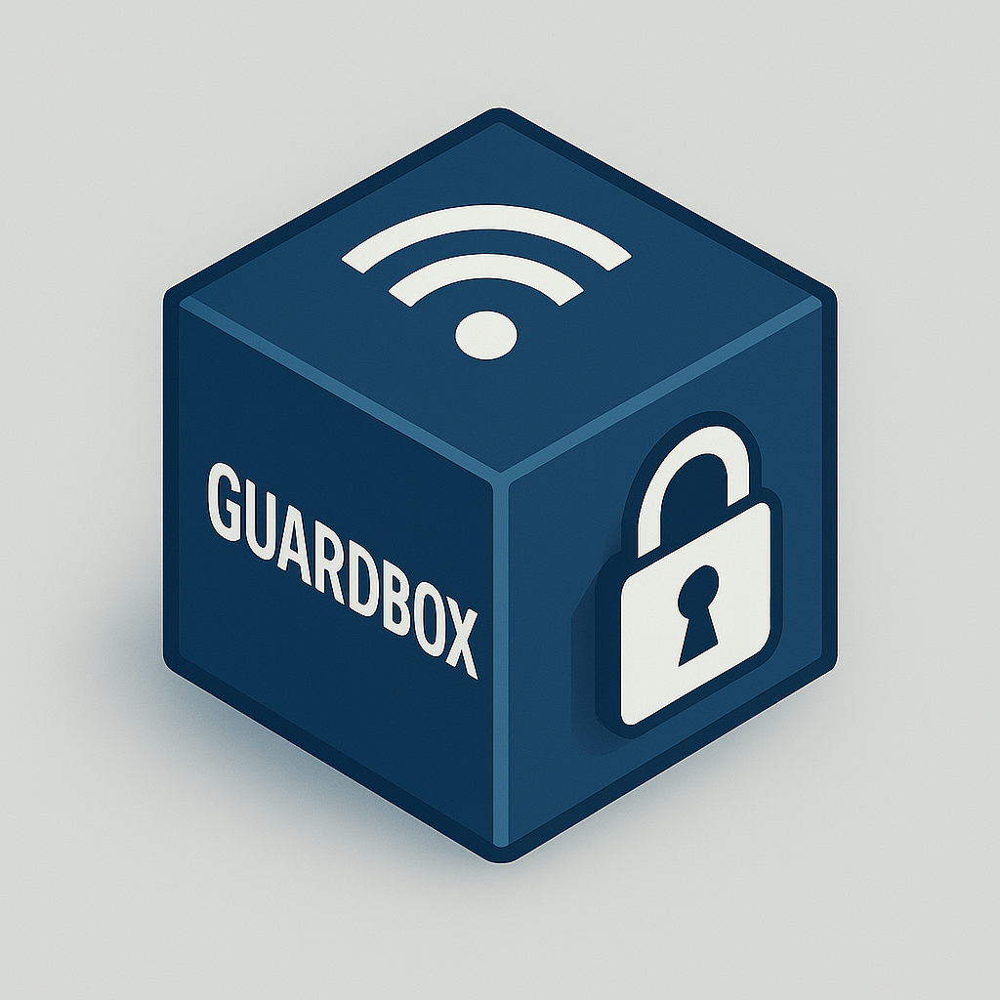
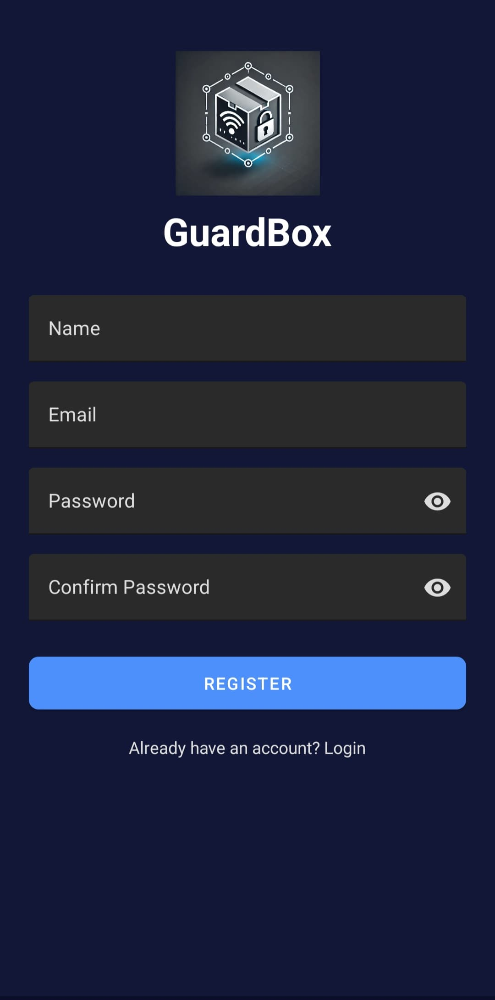
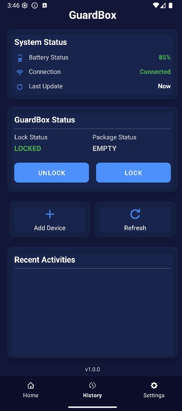
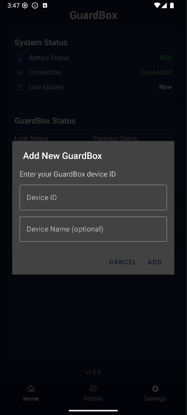
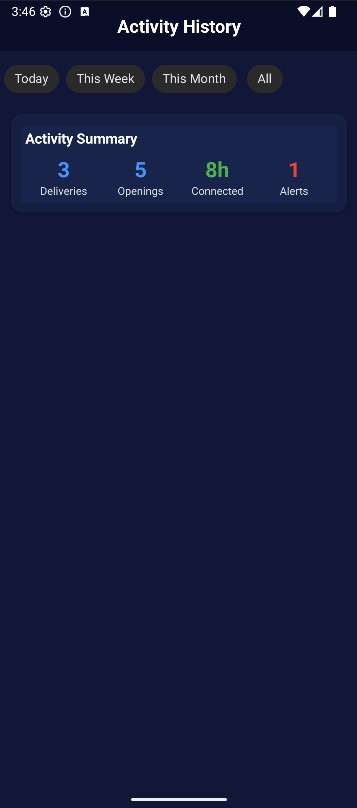
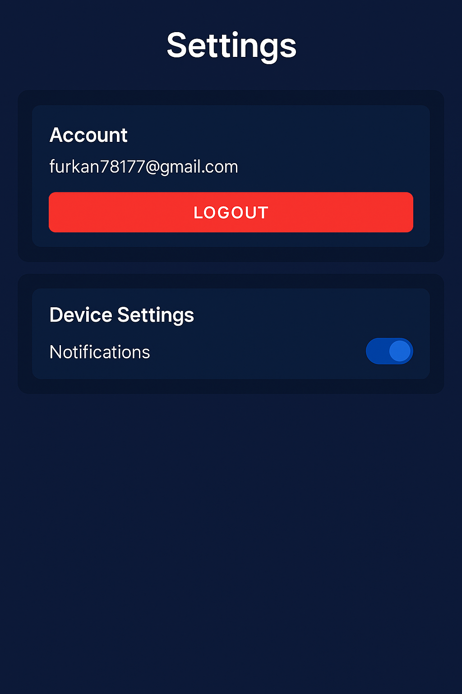

# GuardBox Mobile App 📱🔒

**Secure Smart Package Delivery Control**

A powerful Android application for remotely monitoring and controlling your GuardBox smart package delivery system. Built with modern Android architecture and Firebase integration for real-time security management.

[](https://android.com)
[](https://kotlinlang.org)
[](https://firebase.google.com)
[](https://material.io)
[](https://github.com/FurkanAksoyy/GuardBoxAndroidApp)

<div align="center">

</div>

## 🚀 Features

### 🔐 **Remote Lock Control**
- **Instant Lock/Unlock**: Control your GuardBox remotely from anywhere
- **Real-time Status Updates**: See lock status changes immediately
- **Secure Authentication**: Multi-layer security with Firebase Auth
- **Manual Override**: Emergency unlock capabilities

### 📦 **Package Monitoring**
- **Live Package Detection**: Know when packages arrive instantly
- **Smart Status Display**: Clear "Package Detected" or "Empty" indicators
- **Delivery Notifications**: Get notified the moment packages are secured
- **Weight-based Detection**: Accurate package presence confirmation

### 🛡️ **Security Features**
- **Tampering Alerts**: Immediate notifications for security breaches
- **Activity History**: Complete timeline of all device interactions
- **RFID Card Management**: Add and manage authorized access cards
- **Real-time Monitoring**: Live connection and battery status

### 📱 **Smart Interface**
- **Material Design UI**: Modern, intuitive user experience
- **System Status Dashboard**: Battery level, connection status, last update
- **Quick Actions**: Add Device and Refresh buttons for easy access
- **Activity Timeline**: Detailed history with timestamps
- **User Account Management**: Profile settings and device notifications

### 🔧 **Device Management**
- **Multi-device Support**: Manage multiple GuardBox units
- **Easy Device Pairing**: Simple device ID entry system
- **Device Health Monitoring**: Battery and connection status tracking
- **Notification Controls**: Customizable alert preferences

## 🛠️ Technology Stack

- **Language**: Kotlin
- **Architecture**: MVVM (Model-View-ViewModel)
- **UI Framework**: Material Design Components
- **Backend**: Firebase Realtime Database
- **Authentication**: Firebase Auth
- **Notifications**: Firebase Cloud Messaging
- **Local Storage**: SharedPreferences
- **Network**: Firebase SDK

## 📋 Requirements

- **Android 7.0 (API level 24)** or higher
- **Internet connection** for real-time features
- **GuardBox hardware device** (sold separately)
- **Google Play Services** for Firebase functionality

## 📱 Screenshots

### Authentication & Main Interface
<div align="center">


</div>

*Secure login and real-time control center*

### Device Management & Activity
<div align="center">


</div>

*Easy device pairing and comprehensive activity tracking*

### Notifications
<div align="center">

</div>

*Real-time notification system for security alerts*

## 🔧 Installation & Setup

### 1. Clone the Repository
```bash
git clone https://github.com/FurkanAksoyy/GuardBoxAndroidApp.git
cd GuardBoxAndroidApp
```

### 2. Firebase Configuration

1. Create a new Firebase project at [Firebase Console](https://console.firebase.google.com)
2. Add your Android app to the Firebase project
3. Download `google-services.json` and place it in the `app/` directory
4. Enable the following Firebase services:
   - Authentication (Email/Password)
   - Realtime Database
   - Cloud Messaging (optional for push notifications)

### 3. Build Configuration
```gradle
// In app/build.gradle
android {
    compileSdk 34
    defaultConfig {
        applicationId "com.flare.guardbox"
        minSdk 24
        targetSdk 34
        versionCode 1
        versionName "1.0.0"
    }
}
```

### 4. Dependencies
All required dependencies are included in `build.gradle`. Key libraries:
```gradle
dependencies {
    implementation 'com.google.firebase:firebase-auth:22.3.0'
    implementation 'com.google.firebase:firebase-database:20.3.0'
    implementation 'com.google.firebase:firebase-messaging:23.4.0'
    implementation 'com.google.android.material:material:1.11.0'
    implementation 'androidx.recyclerview:recyclerview:1.3.2'
    implementation 'androidx.constraintlayout:constraintlayout:2.1.4'
}
```

### 5. Build and Run
```bash
./gradlew assembleDebug
```

## 🎮 Usage Guide

### First Time Setup
1. **Create Account**: Register with email and password
2. **Add Device**: Tap "Add Device" and enter your GuardBox device ID
3. **Device Naming**: Give your device a custom name for easy identification
4. **Enable Notifications**: Configure alert preferences in Settings

### Daily Operations

#### Main Dashboard
- **System Status**: Monitor battery (85%), connection status, and last update
- **Lock Control**: Use Lock/Unlock buttons for immediate control
- **Package Status**: See real-time "Package Detected" or "Empty" status
- **Quick Actions**: Access Add Device and Refresh functions

#### Activity Monitoring
- **Recent Activities**: View latest interactions in the main screen
- **Full History**: Access complete timeline via History tab
- **Activity Metrics**: Track deliveries, openings, connected time, and alerts

#### Device Management
- **Multiple Devices**: Manage several GuardBox units from one app
- **Device Health**: Monitor connection status and battery levels
- **Settings**: Configure notifications and account preferences

#### Security Features
- **Live Alerts**: Receive instant tampering notifications
- **Activity Logs**: Review all device interactions with timestamps
- **Secure Access**: Email-based authentication with logout capability

## 🏗️ App Architecture

```
app/
├── src/main/java/com/flare/guardbox/
│   ├── activities/
│   │   ├── MainActivity.kt        # Main dashboard
│   │   ├── LoginActivity.kt       # User authentication
│   │   ├── HistoryActivity.kt     # Activity history
│   │   └── SettingsActivity.kt    # User settings
│   ├── adapters/
│   │   └── ActivityLogAdapter.kt  # RecyclerView adapter
│   ├── models/
│   │   ├── GuardBoxStatus.kt      # Device status model
│   │   ├── ActivityLog.kt         # Activity log model
│   │   └── User.kt               # User data model
│   ├── utils/
│   │   └── FirebaseHelper.kt      # Firebase operations
│   └── services/                  # Background services
├── res/
│   ├── layout/
│   │   ├── activity_main.xml      # Main dashboard layout
│   │   ├── dialog_add_device.xml  # Add device dialog
│   │   └── ...
│   ├── values/
│   │   ├── colors.xml            # App color scheme
│   │   ├── strings.xml           # Text resources
│   │   └── themes.xml            # Material Design themes
│   └── drawable/                  # App icons and graphics
├── images/                        # Screenshots for documentation
└── google-services.json          # Firebase configuration
```

## 🔐 Security Features

- **End-to-End Encryption**: All communications secured with TLS
- **Firebase Security Rules**: Database access restricted to authenticated users
- **Local Data Protection**: Sensitive data encrypted using Android Keystore
- **User Authentication**: Secure email/password system with logout functionality
- **Device Authorization**: Each device requires valid ID for pairing

## 🧪 Testing

### Run Unit Tests
```bash
./gradlew test
```

### Run Instrumentation Tests
```bash
./gradlew connectedAndroidTest
```

### Manual Testing Checklist
- [ ] User registration and login/logout
- [ ] Device pairing with valid/invalid IDs
- [ ] Lock/unlock commands and real-time updates
- [ ] Activity history and metrics accuracy
- [ ] Notification delivery and settings
- [ ] Multi-device management
- [ ] Offline functionality and reconnection

## 📊 Key Features Walkthrough

### System Status Monitoring
- **Battery Level**: Real-time battery percentage display with color coding
- **Connection Status**: Live connection indicator (Connected/Offline)
- **Last Update**: Timestamp of most recent data synchronization

### Smart Lock Control
- **Lock Status**: Clear visual indication with color-coded status
- **Package Detection**: Intelligent weight-based package presence detection
- **One-tap Control**: Instant lock/unlock with immediate visual feedback

### Activity Analytics Dashboard
- **Connection Time**: Track total device uptime and connectivity
- **Delivery Count**: Number of successful package deliveries
- **Access Events**: Count of lock/unlock operations and door openings
- **Security Alerts**: Number of tampering attempts and vibration detections

### Advanced Features
- **Multi-device Support**: Manage multiple GuardBox units seamlessly
- **Real-time Sync**: Instant updates across all connected platforms
- **Offline Support**: Core functionality available without internet
- **Push Notifications**: Immediate alerts for security events

## 🚀 Performance Optimizations

- **Efficient Database Queries**: Optimized Firebase read/write operations
- **Image Caching**: Smart caching for better performance
- **Battery Optimization**: Minimal background processing
- **Network Efficiency**: Compressed data transmission
- **Memory Management**: Proper lifecycle management

## 🤝 Contributing

We welcome contributions! Please follow these steps:

1. Fork the repository
2. Create a feature branch (`git checkout -b feature/AmazingFeature`)
3. Commit your changes (`git commit -m 'Add AmazingFeature'`)
4. Push to the branch (`git push origin feature/AmazingFeature`)
5. Open a Pull Request

### Development Guidelines
- Follow Kotlin coding conventions
- Use Material Design principles
- Write unit tests for new features
- Update documentation as needed
- Test on multiple device sizes and Android versions

### Code Style
```kotlin
// Example code style
class MainActivity : AppCompatActivity() {
    private lateinit var firebaseHelper: FirebaseHelper
    
    override fun onCreate(savedInstanceState: Bundle?) {
        super.onCreate(savedInstanceState)
        setupViews()
        initializeFirebase()
    }
}
```

## 🐛 Known Issues & Solutions

1. **Battery Optimization**: May affect background notifications on some devices
   - **Solution**: Disable battery optimization for GuardBox app in device settings

2. **Initial Device Pairing**: Requires stable internet connection
   - **Solution**: Ensure strong WiFi/mobile data during setup process

3. **Android 6.0 Notification Delays**: Some older devices may experience delayed notifications
   - **Solution**: Update to latest Android version if possible

## 📞 Support & Community

- **Issues**: [GitHub Issues](https://github.com/FurkanAksoyy/GuardBoxAndroidApp/issues)
- **Discussions**: [GitHub Discussions](https://github.com/FurkanAksoyy/GuardBoxAndroidApp/discussions)
- **Email Support**: furkan78177@gmail.com

## 📈 Roadmap

- [ ] **v1.1.0**: Biometric authentication support
- [ ] **v1.2.0**: Offline mode improvements
- [ ] **v1.3.0**: Smart home integration (Alexa, Google Home)
- [ ] **v1.4.0**: Advanced analytics and insights
- [ ] **v1.5.0**: Multi-language support

## 📊 Version History

### v1.0.0 (Current - May 2025)
- Initial release with core functionality
- Firebase integration for real-time communication
- Material Design UI with dark/light theme support
- Multi-device support and management
- Comprehensive activity history tracking
- Push notification system
- Secure user authentication

## 📄 License

This project is licensed under the MIT License - see the [LICENSE](LICENSE) file for details.

```
MIT License

Copyright (c) 2025 Furkan Aksoy

Permission is hereby granted, free of charge, to any person obtaining a copy
of this software and associated documentation files (the "Software"), to deal
in the Software without restriction, including without limitation the rights
to use, copy, modify, merge, publish, distribute, sublicense, and/or sell
copies of the Software, and to permit persons to whom the Software is
furnished to do so, subject to the following conditions:

The above copyright notice and this permission notice shall be included in all
copies or substantial portions of the Software.
```

## 🔗 Related Projects

- [GuardBox Hardware Firmware](https://github.com/FurkanAksoyy/GuardBox-Firmware) - ESP32 firmware for the hardware device
- [GuardBox Web Dashboard](https://github.com/FurkanAksoyy/GuardBox-Web) - Web-based control panel
- [GuardBox Desktop App](https://github.com/FurkanAksoyy/GuardBox-Desktop) - Cross-platform desktop application

## 🏆 Acknowledgments

- Firebase Team for excellent real-time database services
- Material Design Team for beautiful UI components
- Android Development Community for continuous support and resources
- Beta Testers who helped improve the app functionality

## 📱 Download

- **Google Play Store**: [Coming Soon]
- **Direct APK**: Check [Releases](https://github.com/FurkanAksoyy/GuardBoxAndroidApp/releases)

---

<div align="center">

**Built with ❤️ for secure package delivery**

[🌐 Website](https://guardbox.app) • [📚 Documentation](https://docs.guardbox.app) • [💬 Support](https://support.guardbox.app)

⭐ **Star this repo if you found it helpful!** ⭐

</div>

<div align="center">
<sub>Made by <a href="https://github.com/FurkanAksoyy">Furkan Aksoy</a> and contributors</sub>
</div>
